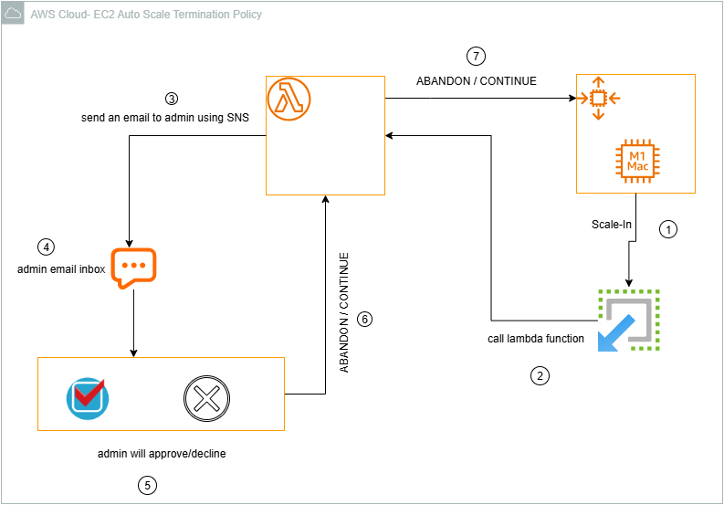
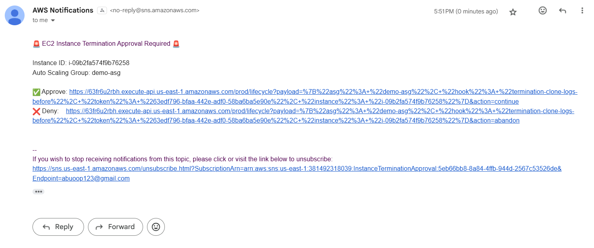
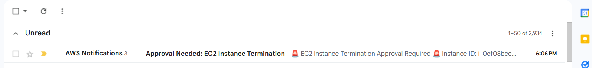
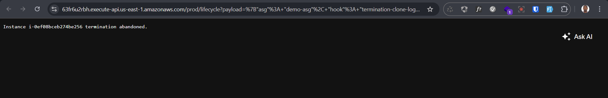

# ASG Termination Policy through AWS Lambda Function

Designed and implemented a robust serverless system to intercept and control the termination of EC2 instances in an AWS Auto Scaling Group (ASG), allowing manual approval or rejection of termination actions by system administrators.

The solution ensures sensitive workloads are not terminated automatically and provides an interactive approval process before proceeding.



## Features

- Lifecycle Hook Integration
    Configured ASG with ``EC2_INSTANCE_TERMINATING`` lifecycle hooks to pause termination events and trigger a Lambda function.

- Lambda Function Logic
A single Lambda function handles:
  - Initial ASG termination hook events
  - Decoding of approval tokens via API Gateway
  - Execution of CompleteLifecycleAction with either ``CONTINUE`` or ``ABANDON``

- Approval Link System
    Dynamically generated approve/deny URLs are embedded in email notifications sent via Amazon SNS to designated administrators.

- Secure Token Passing
    Encoded lifecycle data as URL-safe tokens.

- Manual Intervention Flow
  Clicking on the links (via API Gateway) allows admins to:
  - Approve termination (instance proceeds to terminate)
  - Deny termination (instance is protected from scale-in, remains active)

## Tool Used

- AWS Lambda (Python)
- Amazon EC2 Auto Scaling Lifecycle Hooks
- Amazon SNS (Email Notifications)
- Amazon API Gateway (Link Callback)
- IAM (Scoped permissions for autoscaling actions)

## Requirements

- Create IAM permision to let the lambda function access EC2 autoscal complete lifecycle hook

```json
{
    "Version": "2012-10-17",
    "Statement": [
        {
            "Sid": "VisualEditor0",
            "Effect": "Allow",
            "Action": "autoscaling:CompleteLifecycleAction",
            "Resource": "arn:aws:autoscaling:us-east-1:381492318039:autoScalingGroup:8b38e96e-9745-4bd4-a629-4667bdb6f49f:autoScalingGroupName/demo-asg"
        },
        {
            "Sid": "VisualEditor1",
            "Effect": "Allow",
            "Action": "autoscaling:DescribeLifecycleHooks",
            "Resource": "*"
        }
    ]
}
```

- add permission to access sns or publish sns for the lambda.
- Create lambda function
- Create API Gateway
- Create the SNS topic

```sh
aws sns create-topic --name InstanceTerminationApproval

# subscribe
aws sns subscribe \
  --topic-arn arn:aws:sns:us-east-1:381492318039:InstanceTerminationApproval \
  --protocol email \
  --notification-endpoint abuoop123@gmail.com
```

## Steps To Let work

- terminate or update the autosacling group from 3 to 2
- wathc cloudwatch logs.
- should an email like so
- Use event exists on ``events`` folder to test the lambda function.


- click on approve


- recived email


- decline the termination


## Recommendation

- To enhance this idea more use AWS DynamoDB to store the parameters instead of ecoded them
with expire date, to prevent clicking the same url multiple time.
- Use ``AWS CodeDeploy`` to  deployed.
- Use ``Terraform`` to automate the infrastrcuture.
